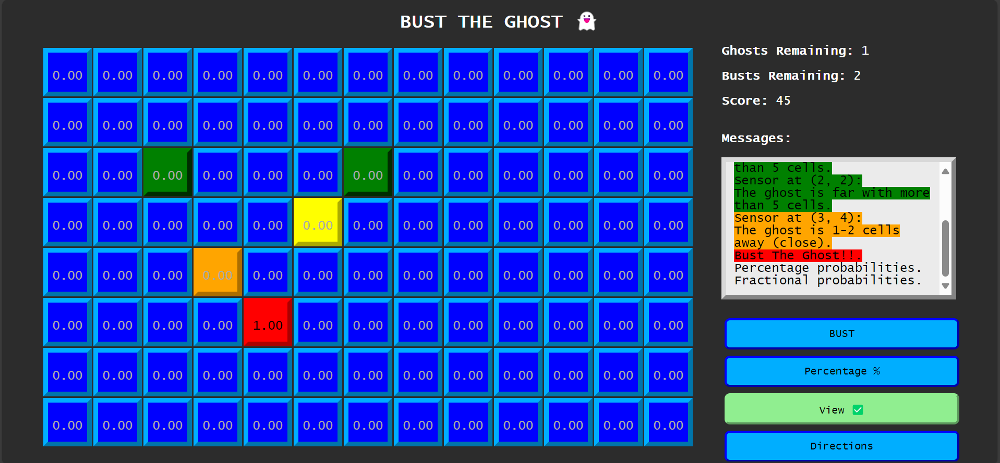

[](https://developer.mozilla.org/en-US/docs/Web/JavaScript)
[](https://www.w3schools.com/css/)
[](https://www.w3.org/html/)

# Ghost Buster Game
<div align="center">
  <a href="https://github.com/NiemaAM/Ghost-Buster-Game">
    
  </a>
</div>

# TABLE OF CONTENTS
<details>
  <summary>Table of Contents</summary>
  <ol>
    <li>
      <a href="#ghost-buster-game">Ghost Buster Game</a>
    </li>
    <li>
      <a href="#try-the-game">Try the Game</a>
    </li>
    <li>
      <a href="#game-structure">Game Structure</a>
      <ul>
        <li><a href="#task1-basic-ghost-game">Task1: Basic Ghost Game</a></li>
        <ul>
          <li><a href="#1-create-a-8x13-grid">1. Create a 8x13 Grid</a></li>
          <li><a href="#2-build-buttons">2. Build Buttons</a></li>
          <li><a href="#3-show-remaining-attempts-and-score">3. Show Remaining Attempts and Score</a></li>
          <li><a href="#4-place-the-ghost">4. Place the Ghost</a></li>
          <li><a href="#5-handle-cell-clicks">5. Handle Cell Clicks</a></li>
          <li><a href="#6-update-posterior-probabilities">6. Update Posterior Probabilities</a></li>
        </ul>
        <li><a href="#task2-use-a-direction-sensor-with-the-distance-sensor">Task2: Use a direction sensor with the distance sensor</a></li>
        <ul>
          <li><a href="#a-conditional-distributions">a. Conditional Distributions</a></li>
          <li><a href="#b-update-posterior-formula">b. Update Posterior Formula</a></li>
          <li><a href="#c-gui-updates">c. GUI Updates</a></li>
        </ul>
      </ul>
    </li>
  </ol>
</details>


## Try the Game
* Online demo: [WebSite](https://ghost-buster-game.vercel.app/)
* Video demo: [Video](https://ghost-buster-game.vercel.app/)
* Clone the project and open [index.html](https://github.com/NiemaAM/Ghost-Buster-Game/blob/main/index.html) file with your browser.

## Game Structure

### Task1: Basic Ghost game

#### 1. Create a 8x13 Grid
```html
<div class="grid" id="gameGrid"></div>
```
```javascript
const gridWidth = 13;
const gridHeight = 8;
// Initialize the game
function initializeGame() {
    const grid = document.getElementById('gameGrid');
    document.getElementById('endGameScreen').style.display = 'none'; 
    grid.innerHTML = '';
    for (let y = 0; y < gridHeight; y++) {
        for (let x = 0; x < gridWidth; x++) {
            const cell = document.createElement('div');
            cell.className = 'cell';
            cell.dataset.x = x;
            cell.dataset.y = y;
            cell.onclick = () => selectCell(x, y);
            grid.appendChild(cell);
        }
    }
    placeGhost();
    updateDisplay();
}
```

#### 2. Build Buttons
Build a button to Bust the ghost and another one called View.
* Bust the ghost button.
```html
<button class="button" id="bustButton" onclick="bust()" disabled>BUST</button>
```
```javascript
// Handle bust button
function bust() {
    busts -= 1;  // Deduct a bust
    if (score > 0)
    if (selectedCell && ghostPosition.xg === selectedCell.x && ghostPosition.yg === selectedCell.y) {
        ghosts -= 1; // Reduce remaining ghosts
        document.getElementById('messages').innerHTML += "You busted the ghost!<br>";
        document.getElementById('endGameScreen').style.display = 'flex'; 
        document.getElementById('endGameMessage').innerHTML = "You busted the ghost!";
        // End the game
        endgame = true;
        // Trigger confetti
        confetti({
            particleCount: 300,
            spread: 100,
            origin: { y: 0.6 },
            decay: 0.94,
            startVelocity: 30,
        });
    } else {
        score -= 5; // Deduct score for wrong guess
        document.getElementById('messages').innerHTML += "Wrong guess!<br>";
        // Game over case (no more busts)
        if (busts <= 0 || score === 0) {
            document.getElementById('messages').innerHTML += "Game Over!<br>";
            document.getElementById('endGameScreen').style.display = 'flex'; 
            document.getElementById('endGameMessage').innerHTML = "Game Over!";
            // End the game
            endgame = true;
        }  
    }
    if (endgame){
        // Disable buttons
        document.getElementById('bustButton').disabled = true;
        //document.getElementById('timeButton').disabled = true;
        // Show solution
        for (let y = 0; y < gridHeight; y++) {
            for (let x = 0; x < gridWidth; x++) {
                sensorReading(x,y);
            }
        }
    }
    document.getElementById('messagesBox').scrollTop = messagesBox.scrollHeight;
    updateDisplay();
}
```
* View is a toggle button. When ticked it should display the probability onto the squares, otherwise the probabilities should not show on the grid.
```html
<button class="button" id="viewButton" onclick="view()">View</button>
```
```javascript
let isView = false; // hide/show the probabilities
// Handle view button
function view() {
    isView = !isView;
    updateDisplay();
}
```
#### 3. Show Remaining Attempts and Score
Show the remaining “bust” attempts & the remaining "score" and "ghosts" at any time.
```html
<div>
  <p style="font-weight: bold;">Ghosts Remaining: <span style="font-weight: lighter;"  id="ghosts">1</span></p>
  <p style="font-weight: bold;">Busts Remaining: <span style="font-weight: lighter;" id="busts">2</span></p>
  <p style="font-weight: bold;">Score: <span style="font-weight: lighter;" id="score">50</span></p>
  <p style="font-weight: bold;">Messages:</p>
</div>
<div id="messagesBox" style="color: black; background-color:#ebebeb; border: 6px outset #d8d8d8; margin-right: 20px; margin-bottom: 20px; padding: 10px; max-height: 200px; overflow-y: auto;">
  <span style="font-weight: lighter;" id="messages"></span>
</div>  
```
```javascript
let ghosts = 1;
let busts = 2;
let score = 50;

// Update the display
function updateDisplay() {
    document.getElementById('ghosts').textContent = ghosts;
    document.getElementById('score').textContent = score;
    document.getElementById('busts').textContent = busts;
    const cells = document.querySelectorAll('.cell');
    cells.forEach(cell => {
        const x = parseInt(cell.dataset.x);
        const y = parseInt(cell.dataset.y);
        cell.textContent = probabilities[y][x].toFixed(2);
        if (!isView) {
            cell.style.color = 'transparent';
        } else {
            cell.style.color = 'black';
        }
    });
}
```
#### 4. Place the Ghost
Have the ghost be placed in one of the cells according to a prior distribution of Ghost over location P0 (Ghost). 
* Define a random variable `G`for ghost location with domain `[(1,1), (1,2), ....(7,13)]`
```javascript
let ghostPosition;
const G = []; // Ghost location domain
//initialize the domain with all cells positions
for (let y = 0; y < gridHeight; y++) {for (let x = 0; x < gridWidth; x++) {G.push({ x, y });}}
```
* `PlaceGhost()` returns xg, yg
```javascript
// Place the ghost randomly
/* PlaceGhost() returns xg, yg */
function placeGhost() {
    const random = Math.floor(Math.random() * G.length); //take a randome position from the domain G
    const xg = G[random].x;
    const yg = G[random].y;
    return ghostPosition = { xg, yg };
}
```
* Sample a uniform distribution for this.
* `ComputeInitialPriorProbabilities(locations)`
```javascript
let probabilities = Array(gridHeight).fill().map(() => Array(gridWidth).fill(1 / (gridWidth * gridHeight)));
// ComputeInitialPriorProbabilities(locations)
function ComputeInitialPriorProbabilities(locations) { //TODO: what is locations?
    const totalCells = gridWidth * gridHeight;
    probabilities = Array(gridHeight).fill().map(() => Array(gridWidth).fill(1 / totalCells));
}
```
#### 5. Handle Cell Clicks
When clicking a cell, the user/player does a sensor reading and gets a color.
  * Each click will make the player loose 1 point from an initial credit. 
  * When the credit runs out the player looses. 
  * The remaining credit should be updated and displayed after each click.
  * User can decide to "bust" a cell. 
  * If ghost is in the cell, the player wins otherwise he/she loses.
  * if the number of allowed busts (initialized to 2) runs out too.
```javascript
let selectedCell = null;
let endgame = false;
// Handle cell selection
function selectCell(x, y) {
    if (!endgame)
    if (score > 0){
        score -= 1; 
        selectedCell = { x, y };
        const cells = document.querySelectorAll('.cell');
        cells.forEach(c => c.classList.remove('selected')); // Remove previous selection
        const cell = document.querySelector(`.cell[data-x='${x}'][data-y='${y}']`);
        cell.classList.add('selected'); // Highlight the selected cell
        // Enable the Bust & Time button when a cell is selected
        document.getElementById('bustButton').disabled = false;
        //document.getElementById('timeButton').disabled = false;
        // Perform sensor reading and update display
        sensorReading(x, y);
        updateDisplay();
    } else {
        document.getElementById('messages').innerHTML += "Game Over!<br>";
        // End the game
        endgame = true;
        document.getElementById('endGameScreen').style.display = 'flex'; 
        document.getElementById('endGameMessage').innerHTML = "Game Over!";
        // Disable buttons
        document.getElementById('bustButton').disabled = true;
        //document.getElementById('timeButton').disabled = true;
        // Show solution
        for (let y = 0; y < gridHeight; y++) {
            for (let x = 0; x < gridWidth; x++) {
                sensorReading(x,y);
            }
        }
    }
}
```
* Define variable `S` for sensor reading with domain `['red', 'orange', 'yellow', 'green']`
``` javascript
const S = ['red', 'orange', 'yellow', 'green']; // Sensor reading domain
```
* Define and use conditional probability distributions `P(Color/Distance from Ghost)` that reflects the sensor’s sensibility for each distance.
``` javascript
const P = {'red': 0.6500, 'orange': 0.20, 'yellow': 0.10, 'green': 0.050}; 
```
* `DistanceSense (xclk,yclk, dist, gx,gy)` returns a color
  * *On the ghost:* `red`
  * *1 or 2 cells away:* `orange`
  * *3 or 4 cells away:* `yellow`
  * *5+ cells away:* `green`
``` javascript
// Separate conditional distribution tables for colors per distance
/* DistanceSense (xclk,yclk, dist, xg,yg) returns a color based on 
(i) the type of distance dist of the clicked position (xclk,yclk) from the ghost position (gs,yg) 
(ii) the conditional probability tables. 
For this you will have to sample the appropriate cond. distribution table to return the color.*/
function DistanceSense(xclk, yclk, dist, xg, yg) {
    dist = Math.abs(xclk - xg) + Math.abs(yclk - yg);
    if (dist === 0) return S[0];
    if (dist <= 2) return S[1];
    if (dist <= 4) return S[2];
    return S[3];
}

// Sensor reading: display color based on distance
function sensorReading(x, y) {
    const color =  DistanceSense(x, y, 0, ghostPosition.xg, ghostPosition.yg);
    // Display the color on the clicked cell
    const cell = document.querySelector(`.cell[data-x='${x}'][data-y='${y}']`);
    cell.style.backgroundColor = color;
    cell.style.borderColor = color;
    UpdatePosteriorGhostLocationProbabilities(color, x, y); 
    // Display the sensor reading with the color and the probability value
    if (!endgame)
        document.getElementById('messages').innerHTML += `<span style="background-color: ${color.toLowerCase()}">sensor at (${x}, ${y}) [${color}] [${probabilities[y][x]}]</span><br>`;
        document.getElementById('messagesBox').scrollTop = messagesBox.scrollHeight;
}
```

#### 6. Update Posterior Probabilities
Update Posterior Ghost Location Probabilities.
After each click number `t` in `{1, 2, 3 …}` at location Li the Posterior Probability of the Ghost locations $Pt(G = Li)$ should be updated using Bayesian inference as follows:
$Pt(G = Li) = P(S = Color at location Li | G = Li) * Pt-1(G = Lj)$
* With $P0(G = Lj)$ is a uniform distribution (Initial prior probability)
* And $P(S = Color at location Li | G = Li) = P(S = Color | distance = 0)$

You will need to normalize all the probabilities of the other locations, after each update of the posteriori probability of the clicked position `Li`.

`UpdatePosteriorGhostLocationProbabilities(Color: c, xclk,yclk)`
```javascript
// Update probabilities using Bayesian inference
/* UpdatePosteriorGhostLocationProbabilities(Color: c, xclk,yclk). 
updates the probabilities for each location based on the color c obtained/sensed at position xclk, yclk*/
function UpdatePosteriorGhostLocationProbabilities(c, xclk, yclk) {
    let totalProbability = 0;
    for (let y = 0; y < gridHeight; y++) {
        for (let x = 0; x < gridWidth; x++) {
            const color = DistanceSense(x, y, 0, ghostPosition.xg, ghostPosition.yg); //return a specific color for each cell
            probabilities[y][x] *= (color === c) ? P[c] : (1 - P[c]);
            totalProbability += probabilities[y][x];
        }
    }
    // Normalize the probabilities so that the sum of all probabilities is 1
    /* You will need to normalize all the probabilities of the other locations, 
    after each update of the posteriori probability of the clicked position Li*/
    for (let y = 0; y < gridHeight; y++) {
        for (let x = 0; x < gridWidth; x++) {
            probabilities[y][x] /= totalProbability; // Normalize each probability
        }
    }
}
```

### Task2: Use a direction sensor with the distance sensor
* The player/agent has now another independent sensor that gives directions of the Ghost. 
* This sensor can be used at any step in conjunction with the distance sensor at the same cell.

#### a. Conditional Distributions
Give the conditional distributions for the direction sensor.

#### b. Update Posterior Formula
Rewrite the formula for updating the posterior probabilities.
The update can happen given evidence from either or both sensors at the same time.

#### c. GUI Updates
Update your GUI for use of the two sensors. 
Implement changes a and b in your code and demonstrate proper working.
